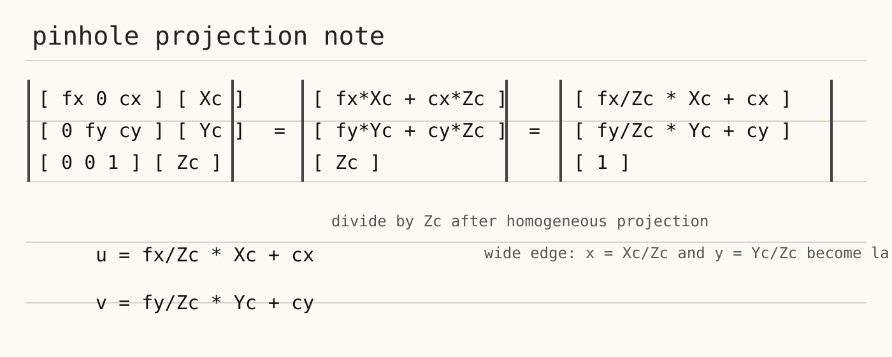
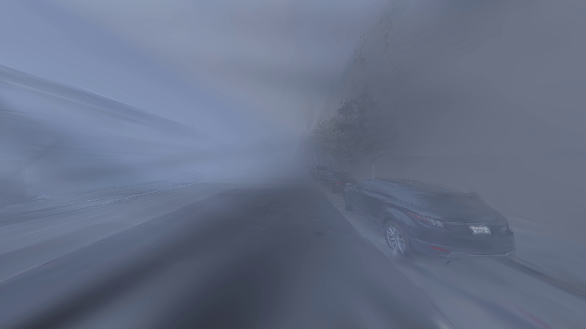

# AEB HIL/VIL 超广角 3DGS 渲染问题记录

本文档专门记录 AEB HIL/VIL 前视超广角相机在 3DGS 渲染中的问题、现象、几何原因和后续解决方案。

当前先记录一个核心问题：

```text
超大 FOV 为什么会让边缘的 Xc/Zc、Yc/Zc 过大，并导致 3DGS 协方差投影的雅可比近似变差？
```

后续新的排查结论和解决方案继续追加到本文档。

通用渲染流程、脚本入口、轨迹和相机 JSON 说明不在本文档展开，避免和超广角问题混在一起。

## 1. 当前问题背景

AEB HIL/VIL 当前关注的实车前视相机是 `front_120/cam1`，关键参数大致为：

```text
width  = 3840
height = 2160
fov_x  = 133.25666 deg
fov_y  = 104.94207 deg
fx     ~= 829.73
fy     ~= 829.58
cx     ~= 1917.57
cy     ~= 1081.59
```

这是一个 4K 超广角相机，不是普通窄 FOV 前视相机。

异常现象主要表现为：

- 图像边缘或上方严重拉伸。
- 边缘 Gaussian splat 被拉成很大的屏幕空间椭圆。
- 画面出现涂抹、模糊、拖影。
- 使用单个 pinhole 相机直接覆盖完整 `133 x 105` 度 FOV 时，边缘问题尤其明显。

## 2. 手写推导图

下图根据本次讨论中的手写 pinhole 投影推导整理，用于固定这次问题背景。



核心 pinhole 投影关系为：

```text
u = fx * Xc / Zc + cx
v = fy * Yc / Zc + cy
```

其中：

- `Xc, Yc, Zc` 是 3D 点在相机坐标系下的坐标。
- `Xc / Zc`、`Yc / Zc` 是归一化像平面坐标。
- `u, v` 是像素坐标。

## 3. 几何解释：为什么边缘归一化坐标过大

后续讨论集中看 pinhole 投影里的两个比值：

```text
x = Xc / Zc
y = Yc / Zc
```

它们就是归一化像平面坐标，也可以由像素坐标反算：

```text
x = (u - cx) / fx
y = (v - cy) / fy
```

图像中心附近，`x` 和 `y` 接近 0。图像边缘处，`x` 和 `y` 的最大量级由 FOV 决定：

```text
|x_edge| ~= tan(fov_x / 2)
|y_edge| ~= tan(fov_y / 2)
```

以 `front_120/cam1` 为例：

```text
fov_x / 2 ~= 66.63 deg
|x_edge| ~= tan(66.63 deg) ~= 2.31

fov_y / 2 ~= 52.47 deg
|y_edge| ~= tan(52.47 deg) ~= 1.30
```

所以超广角边缘的问题根本在于：`Xc / Zc` 和 `Yc / Zc` 的数值已经很大。它们进入 3DGS 协方差投影的雅可比矩阵后，会直接影响屏幕空间 splat 的形状和大小。

## 4. 从 3DGS 协方差投影看 splat 放大

3DGS 中每个 Gaussian 不是一个没有大小的 3D 点，而是一个带 3D 协方差的椭球。渲染时，这个 3D 协方差会被相机投影到屏幕空间，变成 2D 椭圆 splat。

设世界坐标下的 Gaussian 协方差为：

```text
Sigma_3d
```

先把它旋转到相机坐标系：

```text
Sigma_c = Rcw * Sigma_3d * Rcw^T
```

再用 pinhole 投影在当前点附近的一阶线性化，把 3D 协方差投影到 2D 屏幕空间：

```text
Sigma_2d = J * Sigma_c * J^T
```

这里 `J` 是 pinhole 投影函数对相机坐标 `Xc, Yc, Zc` 的局部雅可比矩阵。

对下面的投影关系：

```text
u = fx * Xc / Zc + cx
v = fy * Yc / Zc + cy
```

雅可比为：

```text
J = [
  fx/Zc,      0,  -fx*Xc/Zc^2
      0,  fy/Zc,  -fy*Yc/Zc^2
]
```

把 `x = Xc / Zc`、`y = Yc / Zc` 代入，可以写成：

```text
J = [
  fx/Zc,      0,  -fx*x/Zc
      0,  fy/Zc,  -fy*y/Zc
]
```

如果先把整体尺度项看成同一层面的距离缩放，那么真正体现“大广角边缘”的就是第三列里的 `x` 和 `y`。它们越大，相机坐标中的深度方向扰动越容易被映射成屏幕上的横向或纵向位移。

更直观地看一个简化例子。假设：

```text
fx = fy = f
Sigma_c = sigma^2 * I
```

则有：

```text
J = (f / Zc) * [
  1, 0, -x
  0, 1, -y
]
```

2D 协方差近似为：

```text
Sigma_2d = (f * sigma / Zc)^2 * [
  1 + x^2,  x*y
      x*y,  1 + y^2
]
```

这说明即使整体距离缩放项相同，只要边缘的 `x`、`y` 变大，2D splat 也会沿径向方向被拉长。该矩阵的两个主方向量级可以理解为：

```text
切向标准差量级  ~ f * sigma / Zc
径向标准差量级  ~ (f * sigma / Zc) * sqrt(1 + x^2 + y^2)
```

因此径向相对切向的拉伸比例约为：

```text
sqrt(1 + x^2 + y^2)
```

代入 `front_120/cam1` 的边缘量级：

```text
水平边缘：x ~= 2.31, y ~= 0
径向/切向标准差比例 ~= sqrt(1 + 2.31^2) ~= 2.52

垂直边缘：x ~= 0, y ~= 1.30
径向/切向标准差比例 ~= sqrt(1 + 1.30^2) ~= 1.64

角点附近：x ~= 2.31, y ~= 1.30
径向/切向标准差比例 ~= sqrt(1 + 2.31^2 + 1.30^2) ~= 2.83
```

这解释了一个关键现象：

```text
同一个实际尺度的 3D Gaussian，
在图像中心可能只是一个小 splat，
到了超广角边缘会被投影成一个又大又长的 2D 椭圆。
```

因此，超广角直接渲染的问题不只是像素坐标 `u, v` 变大，而是 3DGS 核心 rasterization 依赖的 `Sigma_2d` 本身也会在边缘变得更大、更扁、更偏径向。

一言以蔽之：

```text
大广角边缘渲染问题的根本原因，
是用单个局部雅可比矩阵近似 pinhole 非线性投影时，
在过大的 Xc/Zc、Yc/Zc 位置上近似质量变差。
```

3DGS 协方差投影使用的是当前 Gaussian 中心点处的一阶线性化。这个近似在图像中心、小 FOV、小 splat 时比较合理；但在超广角边缘，`x`、`y` 很大，雅可比矩阵中的深度耦合项也大，且投影函数在 Gaussian 覆盖范围内变化更剧烈。于是一个 3D Gaussian 更容易被近似成过大、过扁或拖长的 2D 椭圆，最终表现为边缘拉伸、模糊、拖影和涂抹。

## 5. 结论记录

当前结论如下：

1. 超广角边缘问题的核心量是归一化像平面坐标 `x = Xc / Zc`、`y = Yc / Zc`。
2. FOV 越大，图像边缘允许的 `x`、`y` 绝对值越大。
3. `front_120/cam1` 的水平边缘 `|x|` 约为 `2.31`，垂直边缘 `|y|` 约为 `1.30`。
4. 3DGS 的 2D splat 来自 `Sigma_2d = J * Sigma_c * J^T`。
5. 雅可比矩阵里和大广角直接相关的是 `-fx*x/Zc`、`-fy*y/Zc` 这两个深度耦合项。
6. `x`、`y` 越大，2D 协方差越容易被拉成径向长椭圆。
7. 大广角边缘渲染问题的根本原因，是用单个局部雅可比矩阵近似非线性 pinhole 投影时，在大 `x`、大 `y` 位置近似质量变差。

一句话概括：

```text
超广角异常的关键不是 3DGS 场景绑定了某个相机模型，
而是 3DGS 协方差投影中的局部雅可比近似在超大 FOV 边缘变差。
```

## 6. pandaset/003 实测记录

本次用 `outputs/pandaset/003` 场景直接渲染 `front_120/cam1` 真实超广角前视视频。当前代码路径已经回退为单个 pinhole 相机直接渲染，不做超广角分块、不做 ray map / lookup table，也不做 splat 半径裁剪。

运行命令：

```bash
CUDA_VISIBLE_DEVICES=0 bash aeb_hil_vil_render/reconstruction_compare.sh \
  /workspace/HUGSIM/outputs/pandaset/003 \
  /workspace/HUGSIM/outputs/pandaset/003
```

输出文件：

```text
outputs/aeb_hil_vil_render/pandaset/003/aeb_real_front_120_rendered.mp4
outputs/aeb_hil_vil_render/pandaset/003/aeb_real_front_120_rendered.timing.csv
```

### 6.1 渲染画面示例

第 0 帧：



第 40 帧：


能直接看到的问题：

- 画面整体偏蓝灰，低频背景被大面积涂抹。
- 左右边缘和上方出现明显径向拖影，车辆、道路边缘、建筑立面和树枝被拉成长条。
- 中心远处仍能保留部分结构，但越靠近大 FOV 边缘，splat 被拉成径向长椭圆的现象越明显。
- 这和前文分析一致：`front_120/cam1` 的边缘 `Xc/Zc`、`Yc/Zc` 很大，单个局部雅可比矩阵近似 pinhole 非线性投影时，在边缘位置近似质量变差。

### 6.2 渲染耗时统计

本次渲染 80 帧，分辨率为 `3840 x 2160`。计时来自：

```text
outputs/aeb_hil_vil_render/pandaset/003/aeb_real_front_120_rendered.timing.csv
```

汇总结果：

| 指标 | 平均 ms | 最小 ms | 最大 ms | 中位数 ms |
|---|---:|---:|---:|---:|
| camera_ms | 14.419 | 9.966 | 20.924 | 14.261 |
| render_ms | 66.978 | 57.441 | 72.632 | 67.561 |
| postprocess_ms | 88.682 | 80.219 | 101.674 | 85.433 |
| total_ms | 170.351 | 158.373 | 187.875 | 168.978 |

示例帧：

| frame | timestamp_s | camera_ms | render_ms | postprocess_ms | total_ms |
|---:|---:|---:|---:|---:|---:|
| 0 | 0.000 | 14.258 | 63.128 | 85.111 | 162.776 |
| 40 | 4.000 | 14.049 | 66.290 | 82.970 | 163.500 |

<details>
<summary>逐帧 render_ms / total_ms</summary>

| frame | timestamp_s | render_ms | total_ms |
|---:|---:|---:|---:|
| 0 | 0.000 | 63.128 | 162.776 |
| 1 | 0.100 | 65.165 | 158.373 |
| 2 | 0.200 | 64.058 | 161.309 |
| 3 | 0.300 | 67.729 | 164.645 |
| 4 | 0.400 | 70.329 | 168.582 |
| 5 | 0.500 | 70.944 | 171.697 |
| 6 | 0.600 | 72.082 | 169.049 |
| 7 | 0.700 | 72.085 | 168.520 |
| 8 | 0.800 | 68.154 | 163.825 |
| 9 | 0.900 | 71.263 | 167.013 |
| 10 | 1.000 | 72.240 | 167.019 |
| 11 | 1.100 | 72.632 | 169.631 |
| 12 | 1.200 | 71.584 | 168.851 |
| 13 | 1.300 | 70.981 | 164.296 |
| 14 | 1.400 | 72.189 | 168.855 |
| 15 | 1.500 | 71.599 | 169.106 |
| 16 | 1.600 | 70.798 | 166.015 |
| 17 | 1.700 | 71.184 | 166.683 |
| 18 | 1.800 | 68.997 | 164.160 |
| 19 | 1.900 | 66.210 | 161.306 |
| 20 | 2.000 | 70.329 | 169.518 |
| 21 | 2.100 | 68.663 | 163.536 |
| 22 | 2.200 | 64.331 | 162.575 |
| 23 | 2.300 | 67.734 | 165.859 |
| 24 | 2.400 | 66.382 | 166.273 |
| 25 | 2.500 | 68.696 | 165.347 |
| 26 | 2.600 | 68.986 | 171.926 |
| 27 | 2.700 | 67.746 | 167.521 |
| 28 | 2.800 | 65.876 | 161.256 |
| 29 | 2.900 | 70.078 | 168.731 |
| 30 | 3.000 | 72.036 | 174.458 |
| 31 | 3.100 | 69.231 | 167.567 |
| 32 | 3.200 | 66.977 | 162.275 |
| 33 | 3.300 | 67.388 | 162.552 |
| 34 | 3.400 | 69.612 | 168.765 |
| 35 | 3.500 | 70.090 | 165.723 |
| 36 | 3.600 | 68.336 | 167.509 |
| 37 | 3.700 | 67.738 | 164.128 |
| 38 | 3.800 | 64.993 | 160.684 |
| 39 | 3.900 | 68.285 | 164.822 |
| 40 | 4.000 | 66.290 | 163.500 |
| 41 | 4.100 | 64.481 | 158.460 |
| 42 | 4.200 | 63.931 | 176.803 |
| 43 | 4.300 | 62.811 | 178.005 |
| 44 | 4.400 | 62.386 | 179.067 |
| 45 | 4.500 | 64.877 | 161.853 |
| 46 | 4.600 | 63.384 | 162.803 |
| 47 | 4.700 | 62.022 | 163.535 |
| 48 | 4.800 | 61.769 | 168.360 |
| 49 | 4.900 | 62.050 | 168.908 |
| 50 | 5.000 | 66.132 | 175.877 |
| 51 | 5.100 | 67.974 | 182.517 |
| 52 | 5.200 | 68.137 | 180.294 |
| 53 | 5.300 | 69.350 | 174.689 |
| 54 | 5.400 | 65.818 | 176.797 |
| 55 | 5.500 | 67.340 | 171.296 |
| 56 | 5.600 | 68.063 | 173.851 |
| 57 | 5.700 | 65.902 | 174.606 |
| 58 | 5.800 | 68.880 | 179.765 |
| 59 | 5.900 | 69.085 | 176.688 |
| 60 | 6.000 | 70.383 | 185.256 |
| 61 | 6.100 | 68.351 | 187.875 |
| 62 | 6.201 | 67.121 | 178.223 |
| 63 | 6.301 | 68.421 | 178.536 |
| 64 | 6.401 | 68.264 | 180.327 |
| 65 | 6.501 | 65.060 | 173.693 |
| 66 | 6.601 | 67.154 | 177.319 |
| 67 | 6.701 | 66.517 | 175.185 |
| 68 | 6.801 | 66.213 | 174.537 |
| 69 | 6.901 | 67.394 | 180.684 |
| 70 | 7.001 | 66.491 | 180.639 |
| 71 | 7.101 | 65.755 | 181.698 |
| 72 | 7.201 | 65.233 | 177.422 |
| 73 | 7.301 | 62.927 | 172.737 |
| 74 | 7.401 | 61.181 | 173.871 |
| 75 | 7.500 | 59.810 | 174.297 |
| 76 | 7.600 | 57.441 | 170.664 |
| 77 | 7.700 | 58.886 | 171.892 |
| 78 | 7.800 | 57.916 | 172.245 |
| 79 | 7.900 | 60.191 | 170.605 |

</details>

## 7. 后续解决方案记录区

当前 `aeb_hil_vil_render/` 已回退为直接 pinhole 渲染：不做超广角分块、不做 ray map / lookup table 渲染，也不做 splat 半径裁剪。下面只保留后续可能重新研究的方案占位，等实验和代码验证后逐步补充。

### 7.1 分块局部 pinhole 渲染

待补充。

需要记录的问题：

- tile 如何划分。
- tile overlap 如何融合。
- 局部相机的 FOV 如何确定。
- 是否能稳定减少边缘 splat 过度拉伸。

### 7.2 ray map / lookup table 渲染

待补充。

需要记录的问题：

- VTD lookup table 的 `map_x/map_y` 语义。
- 如何从目标像素反算相机射线。
- 如何把整张超广角射线场拆成多个局部 pinhole 相机。
- 如何采样回最终 4K 图像。

### 7.3 splat 半径限制与画质权衡

待补充。

需要记录的问题：

- `max_splat_radius` 对边缘拖影的影响。
- 半径限制是否会引入空洞、断裂或闪烁。
- 和 tile 渲染、lookup table 渲染的组合方式。

### 7.4 训练视角覆盖不足

待补充。

需要记录的问题：

- 训练数据是否覆盖真实 `front_120/cam1` 的完整视场。
- 超出训练视角覆盖区域的边缘内容如何表现。
- 这是重建缺失问题，还是投影模型问题。

### 7.5 实车相机畸变模型

待补充。

需要记录的问题：

- 实车输出是否已经去畸变。
- VTD 图像是否需要 lookup table 才能对齐真实相机输出。
- pinhole、fisheye、equirectangular、lookup table 之间的关系。
