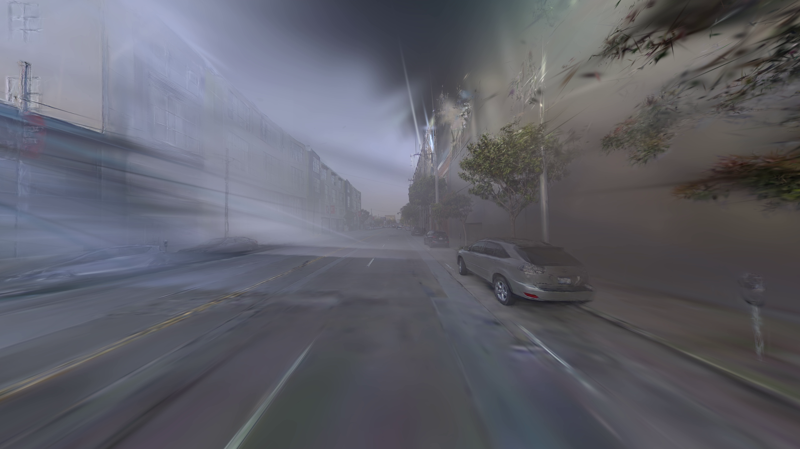

# 超广角 3DGS 渲染

## 1. 当前问题描述

真实车辆前视相机 `front_120` ，该相机的水平 FOV 约为 $133.26^\circ$，垂直 FOV 约为 $104.94^\circ$，分辨率为 `3840 x 2160`，属于明显超广角视场。

### 1.1 图片质量

当前画面的主要问题是边缘区域明显涂抹和径向拖影。图像中心区域还能保留一部分道路、车辆和远处结构，但越接近左右边缘、上边缘和角点，Gaussian splat 越容易被拉成长条状，导致建筑立面、树枝、道路边缘和车辆轮廓变得模糊、变宽、拖尾。

从视觉现象上看，这不是简单的颜色偏差或视频编码问题，而是屏幕空间 splat 本身在超广角边缘被投影成过大的扁长椭圆。多个过大的椭圆相互叠加后，就表现为低频背景被抹开、物体边界被拉长、画面边缘结构不清晰。

pandaset/003场景第 40 帧示例：

### 1.2 渲染速度

本次统计来自 `outputs/aeb_hil_vil_render/pandaset/003/aeb_real_front_120_rendered.timing.csv`，共 `80` 帧，分辨率为 `3840 x 2160`。这里使用 `render_camera_ms` 作为统计口径，即调用 `GaussianSceneRenderer.render_camera()` 并拿到一张 `uint8` RGB 图像的耗时。

| 指标                 | 平均耗时        | 最小/最大耗时             | 对应帧率      | 说明                                                       |
| ------------------ | -----------:| -------------------:| ---------:| -------------------------------------------------------- |
| `render_camera_ms` | `176.120ms` | `159.655/212.675ms` | `5.68FPS` | 包含构造 `scene.cameras.Camera`、3DGS 渲染、结果转 `uint8` 并同步到 CPU |

当前单路 `front_120` 超广角渲染约为 `5.68 FPS`，已经低于 10 FPS；如果扩展到多路相机渲染，实时性压力会更明显。

## 2. 原因分析：边缘 2D 协方差被拉成大而扁的椭圆

3DGS 中每个 Gaussian 不是无尺寸的点，而是一个带 3D 协方差的椭球。渲染时，3D 协方差会通过相机投影变成屏幕空间的 2D 协方差，最终 rasterizer 根据这个 2D 协方差绘制一个椭圆 splat。

设某个 Gaussian 在相机坐标系下的协方差为：

$$
\Sigma_c
$$

屏幕空间 2D 协方差近似为：

$$
\Sigma_{2d} = J \Sigma_c J^{\mathsf{T}}
$$

其中 $J$ 是 pinhole 投影在 Gaussian 中心点处的一阶雅可比矩阵。

pinhole 投影为：

$$
\begin{aligned}
u &= f_x \frac{X_c}{Z_c} + c_x \\
v &= f_y \frac{Y_c}{Z_c} + c_y
\end{aligned}
$$

对应雅可比为：

$$
J =
\begin{bmatrix}
\frac{f_x}{Z_c} & 0 & -\frac{f_x X_c}{Z_c^2} \\
0 & \frac{f_y}{Z_c} & -\frac{f_y Y_c}{Z_c^2}
\end{bmatrix}
$$

令：

$$
\begin{aligned}
x &= \frac{X_c}{Z_c} \\
y &= \frac{Y_c}{Z_c}
\end{aligned}
$$

则：

$$
J =
\begin{bmatrix}
\frac{f_x}{Z_c} & 0 & -\frac{f_x x}{Z_c} \\
0 & \frac{f_y}{Z_c} & -\frac{f_y y}{Z_c}
\end{bmatrix}
$$

这个式子里，超广角边缘最关键的量就是 $x$ 和 $y$。它们不是像素坐标，而是归一化像平面坐标。FOV 越大，图像边缘的 $|x|$、$|y|$ 越大：

$$
\begin{aligned}
|x_{\mathrm{edge}}| &\approx \tan\left(\frac{\mathrm{FOV}_x}{2}\right) \\
|y_{\mathrm{edge}}| &\approx \tan\left(\frac{\mathrm{FOV}_y}{2}\right)
\end{aligned}
$$

对当前相机：

$$
\begin{aligned}
\frac{\mathrm{FOV}_x}{2} &\approx 66.63^\circ,\quad |x_{\mathrm{edge}}| \approx 2.31 \\
\frac{\mathrm{FOV}_y}{2} &\approx 52.47^\circ,\quad |y_{\mathrm{edge}}| \approx 1.30
\end{aligned}
$$

因此在图像边缘，雅可比矩阵第三列中的 $-\frac{f_x x}{Z_c}$、$-\frac{f_y y}{Z_c}$ 会变大。这意味着相机坐标系中的深度方向扰动，会被更强地映射成屏幕上的横向或纵向位移。换句话说，Gaussian 在 3D 里的一个普通椭球，投影到屏幕边缘后会变成更大的 2D 椭圆。

用一个简化例子可以直接看到这个结果。假设：

$$
\begin{aligned}
f_x &= f_y = f \\
\Sigma_c &= \sigma^2 I
\end{aligned}
$$

则：

$$
\Sigma_{2d}
= \left(\frac{f\sigma}{Z_c}\right)^2
\begin{bmatrix}
1 + x^2 & xy \\
xy & 1 + y^2
\end{bmatrix}
$$

这个 2D 协方差矩阵的切向标准差量级约为：

$$
\frac{f\sigma}{Z_c}
$$

径向标准差量级约为：

$$
\frac{f\sigma}{Z_c}\sqrt{1 + x^2 + y^2}
$$

所以边缘位置相对中心位置会出现额外的径向拉伸：

- 水平边缘：$\sqrt{1 + 2.31^2} \approx 2.52$
- 垂直边缘：$\sqrt{1 + 1.30^2} \approx 1.64$
- 角点附近：$\sqrt{1 + 2.31^2 + 1.30^2} \approx 2.83$

这就解释了当前画面质量问题：同样大小的 3D Gaussian，在图像中心附近可能只是一个正常的小 splat；到了超广角边缘，由于 $x = X_c/Z_c$、$y = Y_c/Z_c$ 变大，$\Sigma_{2d}$ 会被拉成更大、更扁、方向更接近径向的椭圆。

这种大而扁的边缘椭圆会覆盖过多像素，并把本来局部的颜色和透明度贡献扩散到更宽区域。多个 Gaussian 同时发生这种投影放大后，边缘图像就会出现涂抹、拖影、模糊和结构拉长。

## 3. 根源：远离光轴后一阶雅可比近似误差变大

上一节的协方差投影还有一个更本质的前提：$\Sigma_{2d} = J \Sigma_c J^{\mathsf{T}}$ 使用的是 pinhole 投影在 Gaussian 中心点处的一阶局部线性近似。

也就是说，它默认 Gaussian 覆盖的那一小块 3D 空间经过投影后，仍然可以近似看成一个线性变换。但 pinhole 投影本身不是线性的：

$$
\begin{aligned}
u &= f_x \frac{X_c}{Z_c} + c_x \\
v &= f_y \frac{Y_c}{Z_c} + c_y
\end{aligned}
$$

从泰勒展开看：

$$
f(p + \delta)
= f(p) + J\delta + \frac{1}{2}\delta^{\mathsf{T}}H\delta + \cdots
$$

3DGS 的协方差投影只保留了一阶项 $J\delta$，忽略了 Hessian 对应的二阶项和更高阶项。这个近似是否有效，取决于投影函数在该 Gaussian 覆盖范围内是否足够接近线性。

靠近光轴时，$x = X_c/Z_c$、$y = Y_c/Z_c$ 较小，pinhole 投影在局部更接近线性，一阶雅可比通常还能较好描述这个 Gaussian 的屏幕投影。

远离光轴时，尤其是在超广角图像边缘，$x$、$y$ 会变大。雅可比中的深度耦合项随之变大：

$$
\begin{aligned}
\frac{\partial u}{\partial Z_c}
&= -\frac{f_x X_c}{Z_c^2}
= -\frac{f_x x}{Z_c} \\
\frac{\partial v}{\partial Z_c}
&= -\frac{f_y Y_c}{Z_c^2}
= -\frac{f_y y}{Z_c}
\end{aligned}
$$

二阶项也会随 $x$、$y$ 增大而变得更明显，例如：

$$
\begin{aligned}
\frac{\partial^2 u}{\partial Z_c^2}
&= \frac{2f_x X_c}{Z_c^3}
= \frac{2f_x x}{Z_c^2} \\
\frac{\partial^2 v}{\partial Z_c^2}
&= \frac{2f_y Y_c}{Z_c^3}
= \frac{2f_y y}{Z_c^2}
\end{aligned}
$$

因此，同一个 3D Gaussian 在图像中心附近可能仍满足局部线性假设；但到了超广角边缘，投影函数在 Gaussian 覆盖范围内变化更剧烈，一阶雅可比已经难以代表整个 Gaussian 的真实投影形状。

从角度上也可以理解这一点。pinhole 投影近似为：

$$
u = f_x \tan(\theta)
$$

当 $\theta$ 接近光轴方向时，$\tan(\theta)$ 的局部变化较平缓；当 $\theta$ 增大到超广角边缘时，$\tan(\theta)$ 和它的高阶变化都会快速增大，线性近似误差也随之放大。
